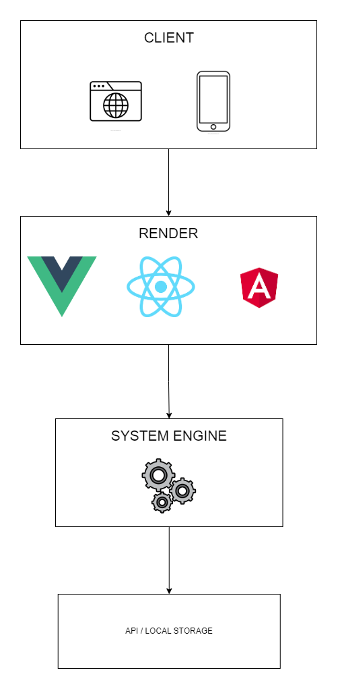

# Arquitetura Limpa

Essa arquitetura foi concebida com base em uma abordagem em camadas, cujo objetivo principal é simplificar as complexidades associadas aos componentes de interface. Essa simplificação tem como foco central tornar o processo de desenvolvimento de sites e aplicativos mais fluído e acessível.

A estrutura em camadas oferece uma organização lógica e modular, permitindo que as diferentes partes da aplicação trabalhem de forma coesa e isolada. Ao minimizar as intricadas interações entre os elementos da interface, essa arquitetura proporciona um ambiente mais propício para a criação e manutenção de projetos.

A simplificação dos componentes de tela não apenas facilita o desenvolvimento, mas também fomenta a reusabilidade, uma vez que elementos individuais podem ser adaptados e reaproveitados em várias partes da aplicação. Isso reduz a redundância de código e contribui para um código mais limpo e eficiente.

Ao adotar essa arquitetura em camadas, o processo de desenvolvimento torna-se mais gerenciável, permitindo que desenvolvedores concentrem-se na criação de funcionalidades e experiências de usuário de alta qualidade, sem serem sobrecarregados pelas complexidades técnicas inerentes à interface.

# Camadas da Arquitetura
Essa abordagem de camadas permite uma organização estruturada da aplicação, separando preocupações específicas e facilitando a manutenção, expansão e colaboração no desenvolvimento. Cada camada desempenha um papel fundamental no ecossistema da aplicação, contribuindo para uma arquitetura mais robusta e eficiente.

## Camada de Renderização (Render)
A camada de renderização é encarregada de transformar os componentes de interface em elementos visuais que os usuários podem interagir. Aqui, os elementos de design, layout e interatividade são combinados para criar uma experiência de usuário coesa e agradável.

## Camada de Motor (Engine)
A camada de motor é o núcleo da aplicação, onde todas as operações essenciais são realizadas. Ela executa validações de dados, aplica as regras de negócio definidas e garante que a lógica da aplicação seja mantida de maneira consistente e eficiente.

## Camada de Armazenamento Local (Local Storage)
Na camada de armazenamento local, o foco está na persistência e recuperação de dados. Sem envolver regras de negócio complexas, essa camada trata da consulta, armazenamento e gerenciamento de informações localmente, proporcionando acesso rápido e eficaz aos dados necessários.

## Camada de Servidor (Server)
A camada de servidor é responsável por estabelecer a conexão com serviços externos e realizar comunicações com eles. Essa interação pode incluir o envio e recebimento de informações para outros sistemas, aplicativos ou APIs, ampliando a funcionalidade da aplicação através de integrações externas.

# Vantagens

- Simplicidade do desenvolvimento

- Organização lógica

- Fácil desenvolver testes automatizados

- Concentração das validações de negócio em um local independente do render escolhido

# Desvantagens

- Aprendizado e Curva de Adoção

- Aclopamento forte com tipo de local storage escolhido (SQLite, Firebase, entre outros)

- Aclopamento forte com protocolos (HTTP, AMQP, entre outros)